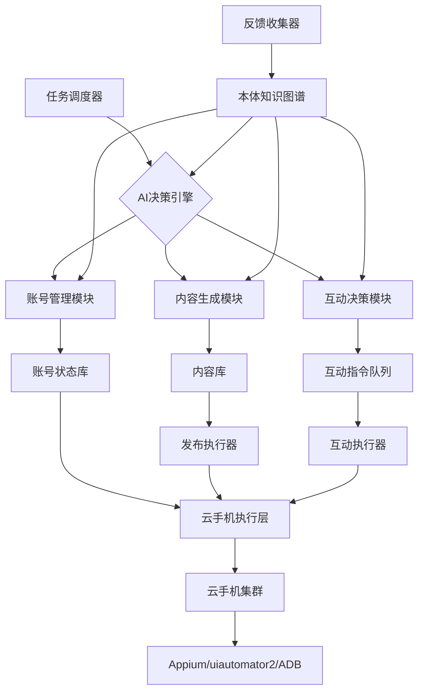

# 本体模型与 AI 调度：从软著申请到云手机社交矩阵

---

## 目录

- [1. 概念澄清：模型本位 vs 本体大模型](#1-概念澄清模型本位-vs-本体大模型)
- [2. 软著申请小范围本体模型：设计与落地](#2-软著申请小范围本体模型设计与落地)
- [3. 构建软著本体需要具备的特质与研发技能](#3-构建软著本体需要具备的特质与研发技能)
- [4. 完整编码实现：可运行的最小项目](#4-完整编码实现可运行的最小项目)
- [5. 10 年研发工程师手搓本体模型：现实性评估](#5-10-年研发工程师手搓本体模型现实性评估)
- [6. 云手机社交矩阵：本体模型驱动的 AI 调度架构](#6-云手机社交矩阵本体模型驱动的-ai-调度架构)

---

## 1. 概念澄清：模型本位 vs 本体大模型

在大模型（LLM）语境中，“本位”有两个容易混淆的含义。

### 1.1 模型本位（Model-native）

核心主张：规划、工具使用、记忆等高级能力应被**内化到模型参数中**，通过端到端学习实现，而非依赖外部脚本框架。

这场范式之争被概括为 **“Big Model vs. Big Harness”**：

| 维度 | 模型本位（Big Model） | 框架本位（Big Harness） |
| --- | --- | --- |
| 核心主张 | 模型本身的能力是王道，框架越薄越好 | 框架工程是关键 |
| 技术路径 | 强化学习，将能力学进参数 | 提示词、工具调用循环、上下文管理 |
| 产业隐喻 | 软件退位，模型登基 | 框架/应用层是差异化关键 |

### 1.2 本体大模型（Large Ontology Model, LOM）

将**形式化本体（Ontology）**与**大语言模型（LLM）**深度融合的 AI 系统。核心目标是为大模型注入结构化、可验证的领域知识，提升推理确定性、可解释性，并显著降低幻觉。

#### 核心架构：构建-对齐-推理（CAR）

1. **构建（Construct）**：从结构化数据库和非结构化文本中抽取实体、关系，构建双层全域本体。
2. **对齐（Align）**：通过图感知编码器和强化学习，将大模型语言能力与本体结构语义对齐。
3. **推理（Reason）**：模型在本体定义的公理和规则体系内，执行确定性推理算法。

#### 关键特点

- **逻辑密度与参数规模解耦**：4B 参数版本在 19 类图推理任务中准确率达 89.47%，超越部分千亿级模型。
- **应用场景**：企业智能决策、电信反诈、金融风控、医疗诊断。
- **当前挑战**：构建成本高、动态演化难、粒度控制难。

---

## 2. 软著申请小范围本体模型：设计与落地

### 2.1 目标

构建一个专门协助申请软件著作权的小范围本体模型，覆盖：

- 申请软著需要提交哪些材料？
- 每种材料的格式和内容要求是什么？
- 材料之间存在哪些一致性约束？
- 常见补正原因有哪些？

### 2.2 核心概念（实体）

| 核心实体 | 说明 |
| --- | --- |
| 申请材料 | 申请表、源代码、操作说明书等 |
| 材料要求 | 格式、页数、行数、页眉等规范 |
| 补正原因 | 审核中常见的驳回或补正情形 |
| 软件信息 | 名称、版本号、开发完成日期等 |

### 2.3 类层次结构

```text
申请材料
├── 软件著作权登记申请表
├── 软件鉴别材料
│   ├── 源程序
│   └── 文档
│       ├── 操作说明书
│       └── 设计说明书
└── 证明文件
```

### 2.4 属性与关系

**数据属性**：

- 源程序：代码行数、每页行数、页眉格式
- 操作说明书：页数要求、截图要求、每页最小行数
- 软件信息：软件名称、版本号

**对象属性**：

- “源程序” — 必须包含 → “核心功能模块”
- “操作说明书” — 必须描述 → “核心功能模块”
- “补正原因” — 源于 → “申请材料”

### 2.5 规则实例

```text
实例：SourceCode_Req_01
  属于材料类型：源程序
  要求内容：代码量≥3000行，不足则提交全部

实例：SourceCode_Req_02
  属于材料类型：源程序
  要求内容：每页50行，共60页，页眉标注软件名称及版本号

实例：Documentation_Req_01
  属于材料类型：文档
  要求内容：每页不少于30行（有图除外）
```

### 2.6 构建工具选择

| 工具 | 特点 | 适用场景 |
| --- | --- | --- |
| Protégé | 免费开源，支持 OWL 标准 | 形式化、可推理的本体 |
| YAML + Onto-Model | 轻量级 | 快速原型、与代码集成 |
| Ontexus | 轻量级平台，支持 LLM 辅助提取 | 从文档自动提取概念 |

### 2.7 落地方式

1. **材料自检清单**：查询本体生成结构化检查表。
2. **补正风险预警**：通过关系层建立“补正原因—申请材料”关联。
3. **与 LLM 结合**：本体提供约束，LLM 审查材料并标注不一致。

---

## 3. 构建软著本体需要具备的特质与研发技能

### 3.1 人与团队特质

1. **领域翻译能力**：把规定变成类、属性、关系和约束。
2. **抽象与克制**：小范围本体要“够用就停”，知道什么不做更重要。
3. **形式化与逻辑思维**：理解类、实例、数据属性、对象属性、公理、约束。
4. **技术实现能力**：图数据库、查询、规则、LLM 集成。
5. **工程落地思维**：以“减少补正”为目标，不做孤立演示。
6. **迭代与维护意识**：规则会变，本体也要变。
7. **跨角色协作**：领域专家 + 知识工程师 + 开发者 + 真实用户。

### 3.2 本体系统本身特质

- 范围极小、目标可验证
- 语义明确、可解释
- 与 LLM 互补
- 可查询、可推理
- 轻量、低成本、易维护
- 可扩展但不提前扩展

### 3.3 研发技能分层

| 层次 | 核心技能 |
| --- | --- |
| 本体建模与知识工程 | OWL 2、RDF、RDFS、SHACL、Protégé |
| 语义查询与推理 | SPARQL、Cypher、HermiT、SWRL、SHACL Rules |
| 编程与数据工程 | Python、rdflib、owlready2、Neo4j、文档解析 |
| 大模型集成与提示工程 | LLM API、Prompt 工程、JSON Schema、RAG |
| 系统开发与工程化 | FastAPI、Streamlit、Docker、任务队列 |
| 评测与质量保障 | 测试集、指标设计、回归测试、CI/CD |

### 3.4 最小技能栈

1. Protégé + OWL
2. Python + rdflib/owlready2
3. SPARQL 或 SHACL
4. LLM API + JSON 输出
5. FastAPI + Streamlit
6. Git + 简单测试

---

## 4. 完整编码实现：可运行的最小项目

### 4.1 项目结构

```text
soft-copyright-ontology/
├── ontology.py          # 本体定义 + 规则实例
├── validator.py         # 基于本体的校验逻辑
├── cli.py               # 命令行入口
├── app.py               # Streamlit Web 界面
├── requirements.txt
└── README.md
```

### 4.2 ontology.py

```python
"""
软著申请小范围本体模型
定义类、属性、规则实例，并提供 SPARQL 查询接口
"""

from rdflib import Graph, Namespace, Literal
from rdflib.namespace import RDF, RDFS, OWL, XSD

SC = Namespace("http://example.org/softcopyright#")


def build_ontology() -> Graph:
    """构建软著申请本体骨架"""
    g = Graph()
    g.bind("sc", SC)
    g.bind("owl", OWL)
    g.bind("rdfs", RDFS)
    g.bind("xsd", XSD)

    # ---------- 类 ----------
    classes = {
        "ApplicationMaterial": "申请材料",
        "SourceCode": "源程序",
        "Documentation": "文档",
        "OperationManual": "操作说明书",
        "DesignManual": "设计说明书",
        "ApplicationForm": "申请表",
        "MaterialRequirement": "材料要求",
        "CorrectionReason": "补正原因",
    }
    for cls, label in classes.items():
        g.add((SC[cls], RDF.type, OWL.Class))
        g.add((SC[cls], RDFS.label, Literal(label, lang="zh")))

    # ---------- 子类关系 ----------
    for sub, sup in [
        ("SourceCode", "ApplicationMaterial"),
        ("Documentation", "ApplicationMaterial"),
        ("OperationManual", "Documentation"),
        ("DesignManual", "Documentation"),
        ("ApplicationForm", "ApplicationMaterial"),
    ]:
        g.add((SC[sub], RDFS.subClassOf, SC[sup]))

    # ---------- 对象属性 ----------
    for prop, label in [
        ("appliesTo", "适用于"),
        ("causedBy", "由...引起"),
        ("hasConsistencyWith", "需与...一致"),
    ]:
        g.add((SC[prop], RDF.type, OWL.ObjectProperty))
        g.add((SC[prop], RDFS.label, Literal(label, lang="zh")))

    # ---------- 数据属性 ----------
    for prop, dtype, label in [
        ("requirementText", XSD.string, "要求内容"),
        ("minimumLines", XSD.integer, "最少行数"),
        ("pageLimit", XSD.integer, "页数限制"),
        ("linesPerPage", XSD.integer, "每页行数"),
        ("hasHeaderFormat", XSD.string, "页眉格式"),
        ("riskLevel", XSD.string, "风险等级"),
    ]:
        g.add((SC[prop], RDF.type, OWL.DatatypeProperty))
        g.add((SC[prop], RDFS.range, dtype))
        g.add((SC[prop], RDFS.label, Literal(label, lang="zh")))

    return g


def add_requirements(g: Graph) -> Graph:
    """填充软著申请的具体规则实例"""

    # ---- 源程序要求 ----
    reqs = [
        ("SourceCode_Req_01", "SourceCode",
         "代码量不少于3000行，不足则全部提交",
         {"minimumLines": 3000}),
        ("SourceCode_Req_02", "SourceCode",
         "每页50行，共提交60页",
         {"linesPerPage": 50, "pageLimit": 60}),
        ("SourceCode_Req_03", "SourceCode",
         "页眉需标注软件名称及版本号",
         {"hasHeaderFormat": "软件名称 + 版本号"}),
        ("Documentation_Req_01", "Documentation",
         "每页不少于30行（有图除外）",
         {"minimumLines": 30}),
        ("Documentation_Req_02", "OperationManual",
         "截图需为运行时全图，不得打马赛克",
         {}),
    ]
    for rid, applies_to, text, extras in reqs:
        node = SC[rid]
        g.add((node, RDF.type, SC.MaterialRequirement))
        g.add((node, SC.appliesTo, SC[applies_to]))
        g.add((node, SC.requirementText, Literal(text, lang="zh")))
        for k, v in extras.items():
            g.add((node, SC[k], Literal(v, datatype=XSD.integer)
                   if isinstance(v, int) else Literal(v, lang="zh")))

    # ---- 一致性要求 ----
    cons = SC["Consistency_Req_01"]
    g.add((cons, RDF.type, SC.MaterialRequirement))
    g.add((cons, SC.requirementText,
           Literal("操作说明书描述的功能必须与源程序实现一致", lang="zh")))
    g.add((cons, SC.hasConsistencyWith, SC.SourceCode))
    g.add((cons, SC.hasConsistencyWith, SC.OperationManual))

    # ---- 补正原因 ----
    corrections = [
        ("Correction_01", "文档与源程序功能不一致", "high",
         ["SourceCode", "OperationManual"]),
        ("Correction_02", "源代码缺少页眉或页眉格式不正确", "medium",
         ["SourceCode"]),
        ("Correction_03", "文档页数不足或每页行数不达标", "medium",
         ["Documentation"]),
    ]
    for cid, text, risk, materials in corrections:
        node = SC[cid]
        g.add((node, RDF.type, SC.CorrectionReason))
        g.add((node, SC.requirementText, Literal(text, lang="zh")))
        g.add((node, SC.riskLevel, Literal(risk)))
        for m in materials:
            g.add((node, SC.causedBy, SC[m]))

    return g


def get_requirements_for(g: Graph, material_type: str) -> list:
    """查询某类材料的全部要求"""
    q = f"""
    PREFIX sc: <{SC}>
    SELECT ?req ?text ?minLines ?pageLimit ?linesPerPage ?header
    WHERE {{
        ?req a sc:MaterialRequirement ;
             sc:appliesTo sc:{material_type} ;
             sc:requirementText ?text .
        OPTIONAL {{ ?req sc:minimumLines ?minLines }}
        OPTIONAL {{ ?req sc:pageLimit ?pageLimit }}
        OPTIONAL {{ ?req sc:linesPerPage ?linesPerPage }}
        OPTIONAL {{ ?req sc:hasHeaderFormat ?header }}
    }}
    """
    out = []
    for row in g.query(q):
        out.append({
            "requirement": str(row.req).split("#")[-1],
            "text": str(row.text),
            "minimumLines": int(row.minLines) if row.minLines else None,
            "pageLimit": int(row.pageLimit) if row.pageLimit else None,
            "linesPerPage": int(row.linesPerPage) if row.linesPerPage else None,
            "headerFormat": str(row.header) if row.header else None,
        })
    return out


def get_correction_risks(g: Graph) -> list:
    """查询所有已知补正原因"""
    q = f"""
    PREFIX sc: <{SC}>
    SELECT ?reason ?text ?risk ?material
    WHERE {{
        ?reason a sc:CorrectionReason ;
                sc:requirementText ?text ;
                sc:riskLevel ?risk ;
                sc:causedBy ?material .
    }}
    """
    out = []
    for row in g.query(q):
        out.append({
            "reason": str(row.reason).split("#")[-1],
            "text": str(row.text),
            "risk": str(row.risk),
            "material": str(row.material).split("#")[-1],
        })
    return out


def load_ontology() -> Graph:
    """一键加载本体 + 规则"""
    g = build_ontology()
    add_requirements(g)
    return g
```

### 4.3 validator.py

```python
"""
基于本体的软著材料校验器
"""

import re
from rdflib import Graph
from ontology import get_requirements_for, get_correction_risks


class MaterialValidator:
    def __init__(self, ontology: Graph):
        self.ontology = ontology

    # ---------- 源程序校验 ----------
    def validate_source_code(self, code_text: str,
                             software_name: str, version: str) -> list:
        issues = []
        lines = code_text.splitlines()
        total_lines = len(lines)

        reqs = get_requirements_for(self.ontology, "SourceCode")

        for req in reqs:
            # 行数下限
            if req["minimumLines"] and total_lines < req["minimumLines"]:
                issues.append({
                    "rule": req["requirement"],
                    "level": "warning",
                    "message": f"源程序共 {total_lines} 行，少于要求的 "
                               f"{req['minimumLines']} 行。若代码总量确实不足，需全部提交。"
                })

            # 页数上限
            if req["linesPerPage"] and req["pageLimit"]:
                expected = req["linesPerPage"] * req["pageLimit"]
                if total_lines > expected:
                    issues.append({
                        "rule": req["requirement"],
                        "level": "info",
                        "message": f"源程序共 {total_lines} 行，超过 {expected} 行。"
                                   f"需按要求提交前 {req['pageLimit']} 页"
                                   f"（每页 {req['linesPerPage']} 行），并删除空白行。"
                    })

            # 页眉检查
            if req["headerFormat"]:
                pattern = rf"{re.escape(software_name)}.*{re.escape(version)}"
                head = "\n".join(lines[:5])
                if not re.search(pattern, head, re.IGNORECASE):
                    issues.append({
                        "rule": req["requirement"],
                        "level": "high",
                        "message": f"未在前5行检测到页眉格式"
                                   f"「{software_name} + {version}」。"
                                   f"请确认每页页眉是否包含软件名称和版本号。"
                    })
        return issues

    # ---------- 文档校验 ----------
    def validate_documentation(self, doc_text: str) -> list:
        issues = []
        lines = doc_text.splitlines()
        total_lines = len(lines)

        for req in get_requirements_for(self.ontology, "Documentation"):
            if req["minimumLines"] and total_lines < req["minimumLines"]:
                issues.append({
                    "rule": req["requirement"],
                    "level": "warning",
                    "message": f"文档共 {total_lines} 行，可能少于要求的 "
                               f"{req['minimumLines']} 行/页。请确认每页行数是否达标。"
                })

        # 截图相关提示
        if re.search(r"马赛克|模糊|截图", doc_text):
            issues.append({
                "rule": "Documentation_Req_02",
                "level": "info",
                "message": "文档中检测到截图相关描述，请确认截图是否为运行时全图，"
                           "且未打马赛克。"
            })
        return issues

    # ---------- 一致性校验 ----------
    def check_consistency(self, code_text: str, doc_text: str) -> list:
        issues = []
        doc_funcs = set(self._extract_functions(doc_text))
        code_funcs = set(self._extract_functions(code_text))
        missing = doc_funcs - code_funcs

        if missing:
            issues.append({
                "rule": "Consistency_Req_01",
                "level": "high",
                "message": f"文档中描述的功能在源代码中未找到对应实现："
                           f"{', '.join(list(missing)[:5])}。"
                           f"这是最常见的补正原因之一。"
            })
        return issues

    @staticmethod
    def _extract_functions(text: str) -> list:
        """简单提取功能关键词（生产环境可替换为 LLM 抽取）"""
        patterns = [
            r"功能[：:]\s*([^\n]+)",
            r"模块[：:]\s*([^\n]+)",
            r"支持([^\n，,。]+)",
        ]
        funcs = []
        for p in patterns:
            for m in re.finditer(p, text):
                v = m.group(1).strip()
                if 0 < len(v) < 50:
                    funcs.append(v)
        return funcs

    # ---------- 汇总报告 ----------
    def generate_report(self, code_text: str, doc_text: str,
                        software_name: str, version: str) -> dict:
        report = {
            "software": {"name": software_name, "version": version},
            "source_code_issues": self.validate_source_code(
                code_text, software_name, version),
            "documentation_issues": self.validate_documentation(doc_text),
            "consistency_issues": self.check_consistency(code_text, doc_text),
            "known_risks": get_correction_risks(self.ontology),
        }
        report["total_issues"] = (
            len(report["source_code_issues"])
            + len(report["documentation_issues"])
            + len(report["consistency_issues"])
        )
        return report
```

### 4.4 cli.py

```python
"""
命令行版：python cli.py --code 源码.txt --doc 说明书.txt --name 我的软件 --version V1.0
"""

import argparse
from ontology import load_ontology
from validator import MaterialValidator


def read_file(path: str) -> str:
    with open(path, "r", encoding="utf-8", errors="ignore") as f:
        return f.read()


def main():
    parser = argparse.ArgumentParser(description="软著申请材料检查器")
    parser.add_argument("--code", required=True, help="源代码文件路径")
    parser.add_argument("--doc", required=True, help="操作说明书文件路径")
    parser.add_argument("--name", default="我的软件", help="软件名称")
    parser.add_argument("--version", default="V1.0", help="版本号")
    args = parser.parse_args()

    ontology = load_ontology()
    validator = MaterialValidator(ontology)

    code_text = read_file(args.code)
    doc_text = read_file(args.doc)

    report = validator.generate_report(
        code_text, doc_text, args.name, args.version
    )

    print("=" * 60)
    print(f"软著申请检查报告：{args.name} {args.version}")
    print("=" * 60)
    print(f"发现问题总数：{report['total_issues']}\n")

    for section, title in [
        ("source_code_issues", "源程序检查"),
        ("documentation_issues", "文档检查"),
        ("consistency_issues", "一致性检查"),
    ]:
        print(f"--- {title} ---")
        if report[section]:
            for issue in report[section]:
                icon = {"high": "🔴", "warning": "🟡", "info": "🔵"}.get(
                    issue["level"], "⚪")
                print(f"{icon} [{issue['rule']}] {issue['message']}")
        else:
            print("✅ 未发现问题")
        print()

    print("--- 已知常见补正原因 ---")
    for risk in report["known_risks"]:
        print(f"- [{risk['risk']}] {risk['text']}")
    print("=" * 60)


if __name__ == "__main__":
    main()
```

### 4.5 app.py

```python
"""
Web 版：streamlit run app.py
"""

import streamlit as st
from ontology import load_ontology, get_requirements_for, get_correction_risks
from validator import MaterialValidator


@st.cache_resource
def get_ontology():
    return load_ontology()


def main():
    st.set_page_config(page_title="软著申请本体模型", page_icon="📋")
    st.title("📋 软著申请本体模型")
    st.caption("基于本体模型，自动检查软著申请材料的一致性和合规性")

    ontology = get_ontology()
    validator = MaterialValidator(ontology)

    # 侧边栏：规则库
    with st.sidebar:
        st.header("📐 本体规则库")
        st.subheader("源程序要求")
        for r in get_requirements_for(ontology, "SourceCode"):
            st.markdown(f"- {r['text']}")
        st.subheader("文档要求")
        for r in get_requirements_for(ontology, "Documentation"):
            st.markdown(f"- {r['text']}")
        st.subheader("常见补正原因")
        for risk in get_correction_risks(ontology):
            st.markdown(f"- `{risk['risk']}` {risk['text']}")

    # 输入区
    col1, col2 = st.columns(2)
    with col1:
        name = st.text_input("软件名称", value="我的软件")
    with col2:
        version = st.text_input("版本号", value="V1.0")

    code_text = st.text_area("源代码（可粘贴前 100 行）", height=180,
                             placeholder="粘贴源代码...")
    doc_text = st.text_area("操作说明书", height=180,
                            placeholder="粘贴操作说明书内容...")

    if st.button("🔍 开始检查", type="primary"):
        if not code_text or not doc_text:
            st.warning("请同时提供源代码和操作说明书内容")
            return

        report = validator.generate_report(code_text, doc_text, name, version)
        st.header("📊 检查报告")
        st.metric("发现问题总数", report["total_issues"])

        for section, title in [
            ("source_code_issues", "源程序检查"),
            ("documentation_issues", "文档检查"),
            ("consistency_issues", "一致性检查"),
        ]:
            st.subheader(title)
            items = report[section]
            if items:
                for issue in items:
                    icon = {"high": "🔴", "warning": "🟡",
                            "info": "🔵"}.get(issue["level"], "⚪")
                    st.markdown(f"{icon} **{issue['rule']}**：{issue['message']}")
            else:
                st.success("✅ 未发现问题")

        with st.expander("⚠️ 已知常见补正原因"):
            for risk in report["known_risks"]:
                st.markdown(f"- `{risk['risk']}` {risk['text']}")


if __name__ == "__main__":
    main()
```

### 4.6 requirements.txt

```text
rdflib>=7.0.0
streamlit>=1.30.0
```

### 4.7 构建与运行

```bash
# 创建虚拟环境（可选）
python -m venv venv
# Windows: venv\Scripts\activate
# macOS/Linux: source venv/bin/activate

# 安装依赖
pip install -r requirements.txt

# 运行 Web 版
streamlit run app.py

# 运行 CLI 版
python cli.py --code code.txt --doc doc.txt --name "测试软件" --version "V1.0"
```

### 4.8 预期输出

```text
============================================================
软著申请检查报告：测试软件 V1.0
============================================================
发现问题总数：3

--- 源程序检查 ---
🟡 [SourceCode_Req_01] 源程序共 5 行，少于要求的 3000 行。若代码总量确实不足，需全部提交。
🔴 [SourceCode_Req_03] 未在前5行检测到页眉格式「测试软件 + V1.0」。请确认每页页眉是否包含软件名称和版本号。

--- 文档检查 ---
🟡 [Documentation_Req_01] 文档共 3 行，可能少于要求的 30 行/页。请确认每页行数是否达标。

--- 一致性检查 ---
🔴 [Consistency_Req_01] 文档中描述的功能在源代码中未找到对应实现：用户登录, 数据导出。这是最常见的补正原因之一。

--- 已知常见补正原因 ---
- [high] 文档与源程序功能不一致
- [medium] 源代码缺少页眉或页眉格式不正确
- [medium] 文档页数不足或每页行数不达标
============================================================
```

---

## 5. 10 年研发工程师手搓本体模型：现实性评估

### 5.1 分层现实性

| 层次 | 具体做什么 | 个人手搓现实吗 | 时间/资源 |
| --- | --- | --- | --- |
| 1. 领域本体 | 用 Protégé/OWL 定义类、属性、关系、规则 | ✅ 非常现实 | 几天到 1 周 |
| 2. 本体校验工具 | Python + rdflib + SPARQL/SHACL | ✅ 现实 | 1-2 周 |
| 3. 本体 + LLM 辅助应用 | LLM 抽取，本体做约束和校验 | ✅ 现实，主流做法 | 2-4 周 |
| 4. 本体增强的 RAG/Agent | GraphRAG、本体约束检索 | ✅ 部分现实 | 1-2 个月 |
| 5. 本体大模型（LOM） | 端到端训练，图感知编码器，RL 对齐 | ❌ 个人不现实 | 团队 + 多卡 GPU |
| 6. 通用本体大模型产品 | 企业级覆盖 | ❌ 需要公司级资源 | 数十人团队 |

### 5.2 优势与短板

**优势**：

- 工程化能力强，知道怎么拆模块、做接口、写测试、部署
- 抽象能力成熟，能把业务规则翻译成数据结构
- 调试和集成经验丰富
- 学习曲线可控，OWL/RDF/SPARQL 几天到两周能上手

**短板**：

- 知识表示的形式化语义（OWL DL、描述逻辑、推理机）
- 图数据库/查询（Neo4j、Cypher、SPARQL）
- LLM 结构化抽取（Prompt 工程、JSON Schema、Function Calling）
- 评测体系（样本集、指标设计）

### 5.3 务实路线

1. 第 1 周：用 Protégé 建 20-50 个类，100-300 个实例
2. 第 2 周：用 rdflib + SPARQL 写查询，输出检查清单
3. 第 3 周：用 SHACL 或 Python 规则实现一致性校验
4. 第 4 周：接入 LLM API，抽取文档功能点
5. 第 5 周：用 Streamlit 做上传界面，跑通端到端
6. 第 6 周：找真实案例测试，迭代规则

### 5.4 结论

- **手搓小范围本体模型，非常现实。**
- **手搓本体大模型，不现实。**
- 可以做“本体驱动的 LLM 应用”，这是当前产业界最务实的落地方式。

---

## 6. 云手机社交矩阵：本体模型驱动的 AI 调度架构

### 6.1 项目背景

- **产品**：基于 RK3588 的云手机调度平台
- **操作**：TikTok、小红书、Twitter 等社交平台发帖、养号、数据采集
- **现有能力**：手动建立任务、定时执行、Appium + uiautomator2 + adb 调用云机
- **新需求**：
  - 根据每个账号的人物背景，自动编写符合人设的帖子内容发帖
  - 自动浏览符合人设的在线内容
  - 评论互动

### 6.2 本体模型的角色定位

本体模型非常适合这个项目，但它的角色是 **“认知与决策中枢”**，而非替代 Appium 或 UI 自动化。

- 现有系统（云手机 + Appium/uiautomator2 + adb）= **“手脚”**
- 本体模型 = **“大脑”**，让操作从“按脚本执行”升级为“按逻辑决策”

### 6.3 账号矩阵知识图谱

#### 6.3.1 人设本体（Persona Ontology）— 定义“我是谁”

- **基本属性**：姓名、年龄、职业、所在地
- **性格特质**：MBTI 类型、大五人格
- **兴趣领域**：科技、美妆、健身、旅行
- **语言风格**：幽默、严肃、专业、口语化
- **内容偏好**：关注的 KOL、常参与的话题

#### 6.3.2 领域本体（Domain Ontology）— 定义“世界是什么”

- **平台规则**：各平台发帖限制、推荐机制、社区规范
- **话题分类**：层级化话题体系（如 科技 -> AI -> 大模型）
- **内容类型**：图文、短视频、投票及其适用场景
- **互动模式**：点赞、评论、转发、@提及的语义和礼仪

#### 6.3.3 关系本体（Relationship Ontology）— 定义“如何互动”

- **账号关系**：互补关系、竞争关系、粉丝关系
- **互动规则**：话题重合度 > 80% 且人设无冲突时触发评论
- **时序关系**：养号阶段任务序列（浏览 -> 点赞 -> 发布）

### 6.4 AI 调度架构



**工作流程**：

1. 任务调度器下达指令（定时或外部触发）
2. AI 决策引擎查询本体知识图谱，结合账号状态，决定下一步行动
3. 发帖：内容生成模块读取人设 + 热点，调用 LLM 生成内容
4. 互动：互动决策模块根据关系规则，生成互动指令
5. 执行器通过现有云手机执行层操作
6. 反馈收集器收集数据，更新本体知识图谱，形成闭环

### 6.5 实现路径

#### 阶段一：知识表示与存储（1-2 周）

- **选择本体语言**：推荐属性图（Property Graph），使用 Neo4j
- **设计 Schema**：
  - 节点：`:Account`, `:Persona`, `:Topic`, `:Post`
  - 关系：`(:Account)-[:HAS_PERSONA]->(:Persona)`,
    `(:Account)-[:FOLLOWS]->(:Topic)`,
    `(:Account)-[:INTERACTS_WITH]->(:Account)`
- **构建知识库**：ETL 脚本导入账号信息、平台规则、历史互动数据

#### 阶段二：AI 决策引擎（2-3 周）

- **集成 LLM**：将 Neo4j 子图（账号人设 + 热门话题）作为 GraphRAG 上下文
- **提示词工程**：设计模板，让 LLM 输出结构化决策：

```json
{
  "action": "post",
  "content_type": "text_with_image",
  "topic": "AI in education",
  "persona_fidelity_score": 0.92,
  "generated_content": "..."
}
```

- **开发决策模块**：解析 LLM 输出为执行指令，处理异常

#### 阶段三：与执行层集成（2-3 周）

- **开发适配器**：将 AI 指令转换为云手机调度平台 API 调用
- **闭环反馈**：执行后抓取结果（帖子 ID、互动数据），写入 Neo4j

### 6.6 关键挑战与风险

| 挑战 | 应对方式 |
| --- | --- |
| 平台风控 | 人设真实性、行为随机性、账号隔离（IP/设备指纹） |
| 内容质量与一致性 | 本体作为“事实校验层”，检查内容是否与知识冲突 |
| 本体维护成本 | 设计本体演化机制，自动/半自动更新知识图谱 |
| 法律与合规风险 | 项目启动前进行合规评估，注意平台服务条款 |

### 6.7 总结

- 本体模型的价值：为系统注入“常识”和“逻辑”，让 AI 调度从“脚本驱动”升级为“知识驱动”
- 实现目标：
  - **人设一致性**：内容和互动始终符合账号人设
  - **决策可解释性**：每一步操作都有明确的逻辑依据
  - **系统可扩展性**：增加新平台、新账号类型时只需扩展本体
- 建议：从**一个平台（如小红书）和一小批账号（5-10 个）**开始试点，快速验证闭环，再逐步扩展。

---

> 文档结束。复制保存为 `ontology-ai-scheduling-guide.md` 即可。